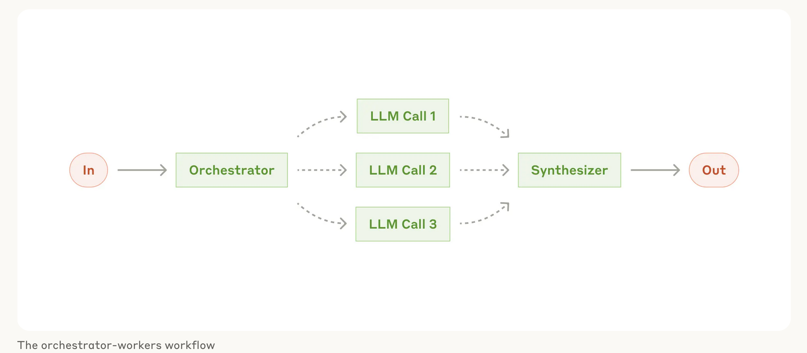
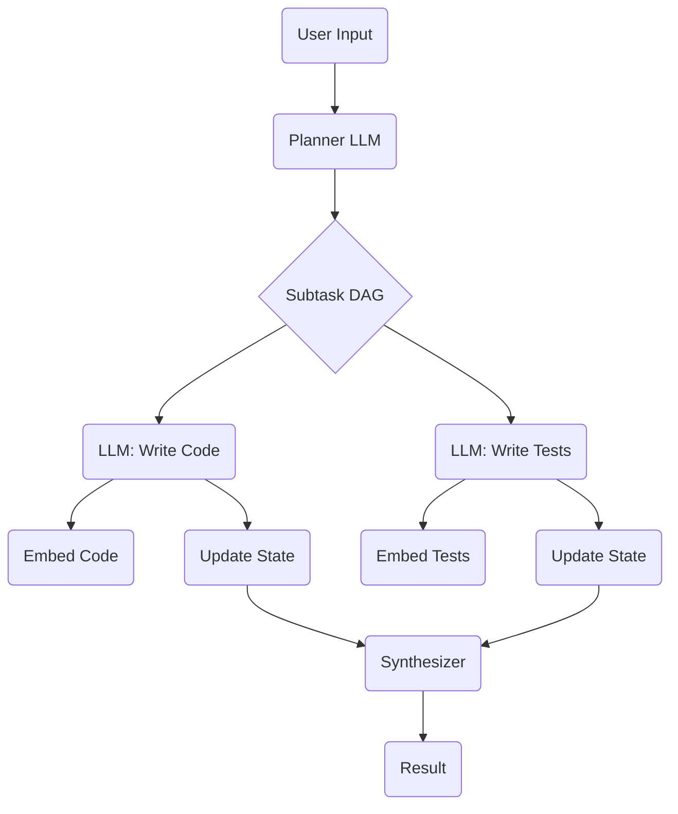

# Design docs
## initial schema
orchestrator-workers architecture.


Thanks! I’ll explore how orchestrators are designed and implemented, especially in the context of multi-step coding agents. This will include both building one from scratch in Python and leveraging frameworks like LangChain and LangGraph. I’ll also break down their roles—like task decomposition, routing, and coordination—and how they fit into the broader agent workflow.

I’ll follow up shortly with a comprehensive deep dive.


# Orchestrator in LLM Agent Workflows

An **orchestrator** in an LLM agent system acts like a central coordinator that breaks a big task into subtasks, dispatches them to specialized worker agents (each usually another LLM call), then synthesizes their outputs. In coding scenarios (such as refactoring or multi-file edits), the orchestrator first analyzes the user’s request and **decomposes** it into smaller pieces – for example, “edit this function,” “update this file,” or “write tests for that module.”  Each subtask is routed to a worker LLM or tool best suited for that job (akin to a routing or task classifier). After all workers complete their tasks, the orchestrator **aggregates** their results into a coherent final answer or code change. This orchestrator-workers pattern is well‑suited for unpredictable, complex tasks: for instance, Anthropic notes that in coding applications the number and nature of file edits can’t be pre‑defined and must be determined dynamically by the orchestrator.

The orchestrator also manages **context and memory** across steps. It retains information about previous subtasks and their outputs (short-term memory within a session) and may store long-term knowledge (e.g. project-specific constants, code style preferences) in an external memory store.  This lets later subtasks access prior results or user preferences. For example, if an earlier subtask discovered that a variable name should be “foo” in one module, that can inform a later subtask.  The orchestrator essentially functions as a state manager, updating a shared “scratchpad” or knowledge base that guides subsequent LLM calls.

Importantly, the orchestrator handles **control flow logic**: it enforces dependencies between subtasks and can retry or branch based on outcomes.  It ensures that prerequisites are completed first (e.g. only synthesize results after all workers are done).  If a worker fails (for instance, generates code with errors or returns no useful result), the orchestrator can **invoke retries or fallbacks**.  In practice, this often means re-prompting the LLM, switching to a different model, or altering the prompt (exponential backoff and fallback strategies can be used).  For example, an orchestrator may detect that generated code fails its tests and then loop back: it refines the prompt and asks a worker to rewrite the code (a self-correction loop).  In summary, the orchestrator decomposes tasks, routes them to workers, maintains shared context/memory, and implements the high-level logic (including retries and conditional branching) that drives the multi-step workflow.

## Implementing an Orchestrator in Python

Building a custom orchestrator in Python typically involves a few key architectural components and patterns:

* **Task Decomposition:** Use an initial LLM call or algorithm to split the input task into structured subtasks. For example, one might define a `TaskDecomposer` class that prompts an LLM to output a JSON list of subtasks, each with fields like `id`, `description`, and `dependencies`. It’s important to ensure *appropriate granularity* (not too coarse or too fine) and to *explicitly record dependencies* between tasks. One strategy is to have the LLM output a small directed acyclic graph (DAG) of subtasks, which the orchestrator then validates and uses as a plan.

* **Task Scheduling and Execution:** Model the workflow as an asynchronous pipeline or graph executor. A common pattern is an **async task queue** or worker pool. For instance, one can use `asyncio` with `asyncio.Queue` and semaphores (as in the *TaskExecutor* example) to run multiple subtasks in parallel up to a concurrency limit. The orchestrator loops: it submits ready tasks (whose dependencies are satisfied) to the queue and awaits their completion. Each “worker” call simply invokes the LLM or tool for that subtask and returns the result. The orchestrator stores results in a shared dictionary or context and then enqueues any newly unblocked tasks. This async pattern allows parallelism (useful if many subtasks are independent) and handles dynamic graphs.

* **Managing Dependencies:** Maintain a data structure (e.g. a graph or dependency list) to ensure tasks run in the correct order. After decomposing tasks, build an execution graph and continuously track which subtasks are complete. The orchestrator should only dispatch a worker when all its predecessor tasks have finished. It should also detect cycles or unsatisfiable dependencies early (e.g. using graph-checks when building the task graph). Code structure often separates the **orchestrator** (planner/coordinator) from **workers** (executors). For example, one might have an `Orchestrator` class with methods like `_create_plan()`, `_execute_tasks()`, and `_synthesize_results()`, while each worker is just an LLM API call wrapped in a function.

* **Concurrency and Libraries:** Key Python libraries for this include `asyncio` (for async scheduling) and concurrency constructs like `concurrent.futures.ThreadPoolExecutor` or `asyncio.gather` for parallel execution. For reliability, use a retry library like \[tenacity] to automatically retry LLM calls on transient failures. If tasks must be distributed across machines or containers, one could integrate a message queue (e.g. RabbitMQ, Celery, or Kafka) or a workflow engine (e.g. Prefect, Airflow) – though those add complexity. For simpler CLI agents, in-process async is often sufficient.

* **Memory and State:** Implement a state store for context and memory. A simple approach is to use Python data structures (dicts, lists) or a local database/file. For persistent or larger-scale context, consider a vector database (like Chroma or Weaviate) for embeddings-based memory, or a key-value store (Redis, SQLite) for facts and dialogue history. The orchestrator should load relevant memory at the start of a request and update it as subtasks produce results (e.g. append new code to a project state or add findings to a report context).

* **Error Handling and Retries:** Integrate error management around each subtask. Use retries with backoff for transient API errors. For logical failures (e.g. code doesn’t compile), catch that event and decide how to proceed: either rerun the worker with adjusted prompt, skip the task, or fail the whole workflow with an informative message. Maintaining **checkpointing** is helpful so the orchestrator can resume or re-run specific subtasks without restarting everything from scratch.

* **Modular Design:** Structure the code into clear modules/classes, e.g.: a **planner** or **TaskDecomposer** that calls the LLM to make subtasks; an **Executor/WorkerPool** that schedules LLM/tool calls; a **Coordinator/Orchestrator** that ties them together; plus utility modules for logging, monitoring, and memory. Define clear interfaces (e.g. each worker should return a standardized result schema). Use docstrings and type annotations (Pydantic models for prompts or results can help keep things structured). Keep the orchestrator logic separate from the prompt engineering and tool implementations, so you can swap in new worker tools or models easily.

In short, a from-scratch orchestrator often looks like:

```python
class Orchestrator:
    def __init__(self, llm, memory, **config): ...
    async def run(self, task_input):
        plan = await self._create_plan(task_input)       # Decompose task
        results = await self._execute_tasks(plan)        # Dispatch subtasks
        return await self._synthesize_results(results)   # Combine outputs
```

Inside `_execute_tasks`, you would use an async loop or gather to run workers, respecting dependencies. This pattern – **decompose, execute in parallel respecting dependencies, then synthesize** – echoes common workflow frameworks and the Orchestrator-Workers design.

## LangChain and LangGraph for Orchestration

**LangChain:** LangChain provides a rich set of building blocks (chains, agents, tools, memory) that can serve as an orchestrator framework. A **chain** in LangChain is a sequence of LLM calls (or steps) where each step’s output feeds the next. This can implement linear workflows easily. An **agent** in LangChain can dynamically choose from multiple tools (including calling the LLM) based on the prompt and context. For coding tasks, LangChain offers utilities like the Python REPL tool, filesystem tools, and even built-in “coding assistants.” Memory modules (e.g. `ConversationBufferMemory` or RAG retrievers) let agents retain context across steps. Core features relevant here include: structured prompts (tool specifications), output parsers, callback handlers for logging, and easy integration with many LLM APIs.

In practice, you could implement an orchestrator as a LangChain agent that has tools for “analysis,” “code generation,” “testing,” etc. For example, the orchestrator could be a LangChain `AgentExecutor` that calls a `plan` function (LLM chain) to break down tasks, then uses a multi-step chain or agent loop to process subtasks. LangChain also has utilities for asynchronous execution and monitoring (LangChain’s **callback handlers** and the LangSmith/Tracer for logging). Its strength is rapid development: you get built-in support for prompt templates, validation, memory, and a variety of APIs (OpenAI, Hugging Face, etc.). However, LangChain is primarily geared toward simpler, mostly linear or branching workflows. It assumes an implicit data flow: data passes from one step to the next and memory is usually a linear buffer. This can make very complex workflows (with loops or many branches) harder to express. LangChain tends to be easier and faster to code, but it may be less flexible for non-linear orchestration. It’s well suited for use cases like sequential code generation and review, QA pipelines, or any step-by-step process.

**LangGraph:** LangGraph (also part of the LangChain ecosystem) is explicitly designed for multi-agent and graph-style workflows. It represents an orchestration as a directed graph of **StateGraph** nodes, where each node can be an LLM agent, a tool, or a custom function. This graph can have arbitrary structure – including branching, loops, and cycles – and includes a shared **state** object that all nodes read and write. For coding, this means you can build flows with feedback loops: e.g. a node generates code, another tests it, and if it fails, control flows back to the generator node with updated context. LangGraph supports conditional transitions (edges that fire based on runtime state), which makes it ideal for the sort of “self-correcting” coding assistant described in the literature. Other core features include explicit state management (you define the schema of the shared state, so data flow is transparent) and integration with the LangSmith platform for monitoring/debugging. In exchange for this power, LangGraph has more complexity: you must explicitly model states and transitions, and the development overhead is higher. But for complex multi-step agents (like coordinating generation, analysis, and testing in a loop), LangGraph shines. For example, using LangGraph one could implement a code-refinement loop where failing test results trigger a state transition back to the code-generation node.

**Trade-offs:** Using LangChain/LangGraph greatly accelerates building an orchestrator by reusing battle-tested components (prompt templates, memory stores, logging). However, it can introduce overhead and less fine-grained control. A custom solution is lightweight and fully customizable, but you must re-implement common features (tool I/O, retries, state management). LangChain is simpler to learn and use for straightforward pipelines, while LangGraph offers more control for complex workflows. Example use cases: LangChain’s agent framework is often used for coding assistants that follow a fixed series of steps (e.g. “write code, run tests, summarize”), whereas LangGraph is used in cutting-edge systems that require loops and multi-agent coordination (e.g. self-debugging code bots or multi-agent code review pipelines).

## Best Practices for Multi-Agent Coding Agents

Orchestrating multiple LLM “worker” agents for software tasks requires careful design:

* **Clear Task Boundaries:** Define each agent’s role narrowly (for example, one agent writes code, another reviews it, another tests it) so that tasks don’t overlap or conflict.  The orchestrator should specify what each worker does and consume its output cleanly. This avoids confusion and allows parallelism.

* **Iterative Feedback Loops:** Incorporate validation and correction steps into the workflow. After a coding agent generates code, immediately run it against a suite of tests or a static analyzer. If issues are found, feed the results back to a code-fixing agent. This loop (generated code → test → regenerate) is crucial for reliability. LangGraph makes this easy with conditional transitions: on test failure, loop back and refine the prompt.

* **Maintain Shared State:** For coding tasks, the “state” might include the current codebase, variables, and previous outputs. Use a centralized state store (in memory or a file-based project state) that all agents read and update. The orchestrator updates this state between steps. This ensures consistency (agents don’t work with stale data) and context (later steps know what earlier steps did).

* **Error Handling and Retries:** Build robust error logic. If an agent fails (e.g. code has syntax errors or an API call times out), the orchestrator should catch it and decide on a fallback. For critical subtasks like code execution, have timeout/retry policies or alternate models ready (e.g. a simpler model if the main one times out). Don’t let one failure silently break the workflow.

* **Logging and Observability:** Log every step’s inputs, outputs, and decisions. Tools like LangSmith (for LangGraph/Chain) or custom dashboards can help trace the chain of thought. This is important for debugging complex multi-agent flows. For instance, after a subtask, record whether it succeeded or triggered a loop.

* **Resource Management:** Ensure the orchestrator limits concurrency to avoid resource exhaustion (especially if agents run on expensive models or services). Implement a **ResourceManager** that tracks usage (e.g. open file handles, CPU/GPU time) and enforces quotas. Release resources promptly after use. Monitor performance and memory to detect leaks or bottlenecks.

* **Security and Safety:** When agents generate code, sandbox execution environments to prevent malicious or harmful actions. Validate any action that interfaces with external systems. Apply content filters as needed on LLM outputs (especially if agent outputs might include system commands).

* **Human-in-the-Loop:** For high-stakes coding tasks, consider checkpointing and pausing for user approval at key steps (e.g. before applying large changes). This adds confidence and lets a human override the automated flow if needed.

* **Testing and Simulation:** Thoroughly test the orchestrator architecture with mock tasks before using real code. Simulate worker failures, network timeouts, and malformed outputs to ensure the orchestrator handles these gracefully.

In summary, treat the orchestrator as a **lightweight workflow engine**: it should enforce the logical flow of a coding project, keep agents focused on their subtasks, and adapt when things go wrong. Using hierarchical design (manager agent + worker agents) enables scaling complex code tasks into smaller, manageable units. Careful attention to dependencies, memory, and error paths will make a multi-agent coding agent robust and effective for real-world software development.


Great questions — let’s break them down:

---

## ✅ Dependencies Between Subtasks

When building a coding agent that performs **multi-step workflows**, task **dependencies** define **which subtasks must be completed before others can start**.

### 🔧 Real-World Examples in Coding Agents

1. **Generate Code → Write Tests → Run Tests → Refactor**

   * You can't run tests until the code and tests exist.
   * You shouldn't refactor until tests pass.

2. **Multi-file Editing**

   * If file A depends on a class defined in file B, then editing file B must happen before A’s edit can be validated or executed.

3. **“Analyze the Codebase” → “Decompose Main Task” → “Apply Changes”**

   * Initial codebase scan informs what tasks even exist.
   * Decomposition depends on understanding project structure.

So these dependencies are often **semantic** and **dynamic** — they change based on the problem.

---

### 🧠 How to Represent Dependencies

You typically model the tasks and their dependencies as a **directed acyclic graph (DAG)**:

```python
tasks = {
    "analyze_codebase": [],
    "generate_code": ["analyze_codebase"],
    "write_tests": ["generate_code"],
    "run_tests": ["write_tests"],
    "refactor": ["run_tests"]
}
```

* You can then topologically sort the graph or use an async task executor that:

  * Checks if all `prerequisites` are complete before executing a node.
  * Supports **concurrency**: if `generate_code` and `analyze_dependencies` are independent, they can run in parallel.

👉 For complex workflows (like with loops or conditionals), consider a **finite state machine** or a framework like **LangGraph** which natively supports graph-based execution with dynamic state.

---

## 🧠 Managing Context and State

Your orchestrator and workers need **shared memory** to avoid hallucinating or repeating steps. State management is **crucial** for:

* Tracking subtasks and results
* Sharing variables, summaries, function names, filenames, etc.
* Logging progress and planning next steps
* Ensuring semantic consistency (e.g., variable names across files)

### 📦 Options for State Management

| Type                                  | Use Case                            | Pros                           | Cons                          |
| ------------------------------------- | ----------------------------------- | ------------------------------ | ----------------------------- |
| **In-Memory Dict**                    | Fast prototyping, simple sessions   | Very fast, no setup            | Lost on crash, not persistent |
| **SQLite / JSON File**                | Persist small state across runs     | Easy to query / reload         | Slower, needs serialization   |
| **Redis**                             | Distributed agents                  | Fast, supports pub/sub         | Needs infra                   |
| **Vector DB (e.g. Chroma, Weaviate)** | Embeddings-based memory (see below) | Supports RAG, long-term recall | Complexity, cost              |

---

### 🧩 Should You Use RAG on the Codebase?

**Yes**, especially for medium to large codebases. RAG (Retrieval-Augmented Generation) allows agents to **ask questions about the project** without having the entire codebase in context.

### 🔍 Why RAG Is Useful

* You can’t fit a full project into a single LLM prompt.
* Code is highly structured — semantic search often outperforms naive token search.
* Your agents can dynamically query **relevant files, function docs, commit messages**, etc.

### 🛠️ What You Should Embed

* File paths and docstrings
* Function and class definitions
* Readme / setup files
* Architecture diagrams or markdown notes
* Git history / commit summaries (for context-aware refactoring)

Use a chunking strategy (e.g. function-based) and tag each vector with metadata like:

```json
{
  "file": "utils/parser.py",
  "function": "parse_json",
  "type": "function_def",
  "tokens": 126
}
```

Then agents can retrieve with semantic search:

* “How is the config loaded?”
* “Where is the entry point for the app?”
* “Which classes use `DataLoader`?”

You can implement this with:

* `langchain.retrievers`
* `llama-index` (great for hierarchical code structures)
* Your own embedding store (e.g. FAISS, Chroma)

---

## 🧩 Orchestrator + RAG Hybrid Design

Here's a basic structure:



Your orchestrator handles:

* State sharing
* Graph execution
* Calling RAG-based retrievers to augment prompts with relevant code
* Storing/refreshing memory as tasks finish

---

## 🧠 Final Thoughts

If you're building from scratch:

* Start with a **shared in-memory state object** (dict or custom class)
* Store **task graph + results + memory + current status**
* Layer in **RAG for context injection** in prompts
* Use **LangGraph or `asyncio`** for orchestrated execution if dynamic DAGs and retries are needed

Would you like a basic orchestrator template with dependency graph and memory handling to kickstart?

